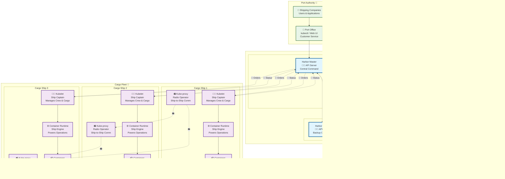

```mermaid
graph TB
    subgraph "Harbor Control Tower 🏗️"
        subgraph "Control Ship 1 ⚓"
            Captain1[Harbor Master<br/>🧑‍✈️ API Server<br/>Central Command]
            LogBook1[📚 etcd<br/>Ship Registry<br/>Cargo Manifest]
            Dispatcher1[📋 Scheduler<br/>Cargo Assignment<br/>Ship Selection]
            Supervisors1[👮 Controllers<br/>Fleet Supervisors<br/>Safety Officers]
        end
        
        subgraph "Control Ship 2 ⚓"
            Captain2[Harbor Master<br/>🧑‍✈️ API Server<br/>Backup Command]
            LogBook2[📚 etcd<br/>Ship Registry<br/>Backup Records]
            Dispatcher2[📋 Scheduler<br/>Backup Assignment]
            Supervisors2[👮 Controllers<br/>Backup Supervisors]
        end
    end
    
    subgraph "Cargo Fleet 🚢"
        subgraph "Cargo Ship 1"
            ShipCaptain1[👨‍✈️ Kubelet<br/>Ship Captain<br/>Manages Crew & Cargo]
            RadioOp1[📻 Kube-proxy<br/>Radio Operator<br/>Ship-to-Ship Comm]
            CargoHold1[📦 Containers<br/>Cargo Hold<br/>Application Loads]
            Engine1[⚙️ Container Runtime<br/>Ship Engine<br/>Powers Operations]
        end
        
        subgraph "Cargo Ship 2"
            ShipCaptain2[👨‍✈️ Kubelet<br/>Ship Captain<br/>Manages Crew & Cargo]
            RadioOp2[📻 Kube-proxy<br/>Radio Operator<br/>Ship-to-Ship Comm]
            CargoHold2[📦 Containers<br/>Cargo Hold<br/>Application Loads]
            Engine2[⚙️ Container Runtime<br/>Ship Engine<br/>Powers Operations]
        end
        
        subgraph "Cargo Ship 3"
            ShipCaptain3[👨‍✈️ Kubelet<br/>Ship Captain<br/>Manages Crew & Cargo]
            RadioOp3[📻 Kube-proxy<br/>Radio Operator<br/>Ship-to-Ship Comm]
            CargoHold3[📦 Containers<br/>Cargo Hold<br/>Application Loads]
            Engine3[⚙️ Container Runtime<br/>Ship Engine<br/>Powers Operations]
        end
    end
    
    subgraph "Port Authority 🏢"
        ShippingCorp[🏢 Shipping Companies<br/>Users & Applications]
        PortOffice[🏪 Port Office<br/>kubectl / Web UI<br/>Customer Service]
    end
    
    %% Communication flows
    ShippingCorp --> PortOffice
    PortOffice --> Captain1
    
    Captain1 <--> LogBook1
    Captain1 <--> Dispatcher1
    Captain1 <--> Supervisors1
    
    %% High availability
    LogBook1 <--> LogBook2
    Captain1 <--> Captain2
    
    %% Command to ships
    Captain1 -.->|📡 Orders| ShipCaptain1
    Captain1 -.->|📡 Orders| ShipCaptain2
    Captain1 -.->|📡 Orders| ShipCaptain3
    
    %% Ship operations
    ShipCaptain1 --> Engine1
    ShipCaptain2 --> Engine2
    ShipCaptain3 --> Engine3
    
    Engine1 --> CargoHold1
    Engine2 --> CargoHold2
    Engine3 --> CargoHold3
    
    %% Ship-to-ship communication
    RadioOp1 -.->|📻| RadioOp2
    RadioOp1 -.->|📻| RadioOp3
    RadioOp2 -.->|📻| RadioOp3
    
    %% Status reporting
    ShipCaptain1 -.->|📡 Status| Captain1
    ShipCaptain2 -.->|📡 Status| Captain1
    ShipCaptain3 -.->|📡 Status| Captain1
    
    %% Annotations
    Note1[💡 Control Ships manage<br/>the entire fleet operations<br/>and maintain coordination]
    Note2[💡 Cargo Ships carry the<br/>actual workload and report<br/>status to control ships]
    Note3[💡 Radio operators enable<br/>ship-to-ship communication<br/>for coordinated operations]
    
    %% Styling
    classDef control fill:#e1f5fe,stroke:#01579b,stroke-width:3px
    classDef cargo fill:#f3e5f5,stroke:#4a148c,stroke-width:2px
    classDef external fill:#e8f5e8,stroke:#1b5e20,stroke-width:2px
    classDef note fill:#fffde7,stroke:#f57f17,stroke-width:1px,stroke-dasharray: 5 5
    
    class Captain1,Captain2,LogBook1,LogBook2,Dispatcher1,Dispatcher2,Supervisors1,Supervisors2 control
    class ShipCaptain1,ShipCaptain2,ShipCaptain3,RadioOp1,RadioOp2,RadioOp3,CargoHold1,CargoHold2,CargoHold3,Engine1,Engine2,Engine3 cargo
    class ShippingCorp,PortOffice external
    class Note1,Note2,Note3 note
    
```
