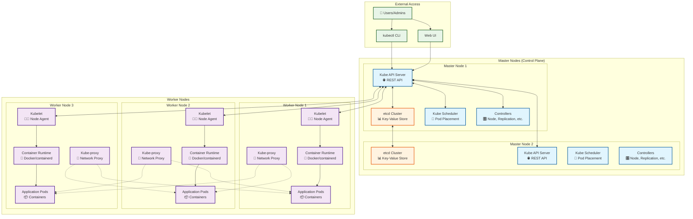

```mermaid
graph TB
    subgraph MasterNodes["Master Nodes (Control Plane)"]
        subgraph Master1["Master Node 1"]
            etcd1[etcd Cluster<br/>📊 Key-Value Store]
            api1[Kube API Server<br/>🌐 REST API]
            sched1[Kube Scheduler<br/>📅 Pod Placement]
            ctrl1[Controllers<br/>🎛️ Node, Replication, etc.]
        end
        
        subgraph Master2["Master Node 2"]
            etcd2[etcd Cluster<br/>📊 Key-Value Store]
            api2[Kube API Server<br/>🌐 REST API]
            sched2[Kube Scheduler<br/>📅 Pod Placement]
            ctrl2[Controllers<br/>🎛️ Node, Replication, etc.]
        end
    end
    
    subgraph WorkerNodes["Worker Nodes"]
        subgraph Worker1["Worker Node 1"]
            kubelet1[Kubelet<br/>👨‍✈️ Node Agent]
            proxy1[Kube-proxy<br/>🔄 Network Proxy]
            runtime1[Container Runtime<br/>🐳 Docker/containerd]
            pods1[Application Pods<br/>📦 Containers]
        end
        
        subgraph Worker2["Worker Node 2"]
            kubelet2[Kubelet<br/>👨‍✈️ Node Agent]
            proxy2[Kube-proxy<br/>🔄 Network Proxy]
            runtime2[Container Runtime<br/>🐳 Docker/containerd]
            pods2[Application Pods<br/>📦 Containers]
        end
        
        subgraph Worker3["Worker Node 3"]
            kubelet3[Kubelet<br/>👨‍✈️ Node Agent]
            proxy3[Kube-proxy<br/>🔄 Network Proxy]
            runtime3[Container Runtime<br/>🐳 Docker/containerd]
            pods3[Application Pods<br/>📦 Containers]
        end
    end
    
    subgraph External["External Access"]
        users[👥 Users/Admins]
        kubectl[kubectl CLI]
        ui[Web UI]
    end
    
    %% External connections
    users --> kubectl
    users --> ui
    kubectl --> api1
    ui --> api1
    
    %% Master node internal connections
    api1 <--> etcd1
    api1 <--> sched1
    api1 <--> ctrl1
    
    %% High availability connections
    etcd1 <--> etcd2
    api1 <--> api2
    
    %% Master to worker connections
    api1 <--> kubelet1
    api1 <--> kubelet2
    api1 <--> kubelet3
    
    %% Worker node internal connections
    kubelet1 --> runtime1
    kubelet2 --> runtime2
    kubelet3 --> runtime3
    
    runtime1 --> pods1
    runtime2 --> pods2
    runtime3 --> pods3
    
    %% Inter-pod communication
    proxy1 -.-> pods2
    proxy1 -.-> pods3
    proxy2 -.-> pods1
    proxy2 -.-> pods3
    proxy3 -.-> pods1
    proxy3 -.-> pods2
    
    %% Styling
    classDef master fill:#e1f5fe,stroke:#01579b,stroke-width:2px
    classDef worker fill:#f3e5f5,stroke:#4a148c,stroke-width:2px
    classDef external fill:#e8f5e8,stroke:#1b5e20,stroke-width:2px
    classDef storage fill:#fff3e0,stroke:#e65100,stroke-width:2px
    
    class etcd1,etcd2,api1,api2,sched1,sched2,ctrl1,ctrl2 master
    class kubelet1,kubelet2,kubelet3,proxy1,proxy2,proxy3,runtime1,runtime2,runtime3,pods1,pods2,pods3 worker
    class users,kubectl,ui external
    class etcd1,etcd2 storage
```
