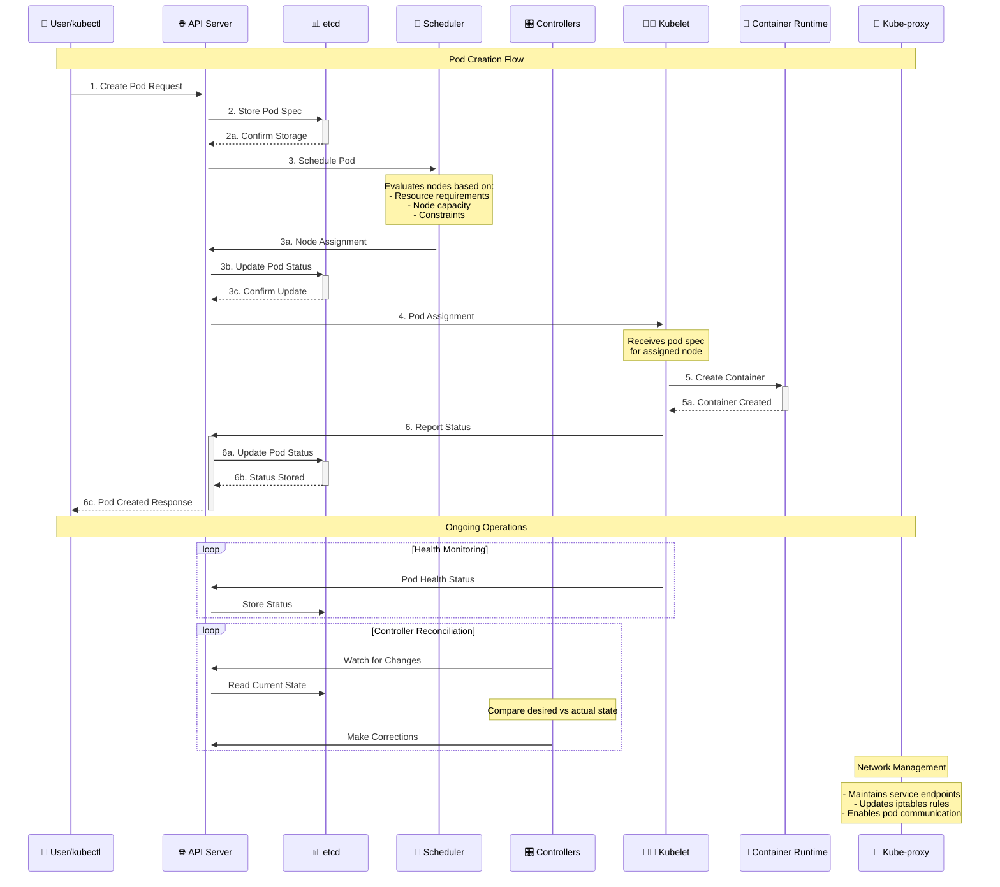

```mermaid
sequenceDiagram
    participant User as 👥 User/kubectl
    participant API as 🌐 API Server
    participant etcd as 📊 etcd
    participant Sched as 📅 Scheduler
    participant Ctrl as 🎛️ Controllers
    participant Kubelet as 👨‍✈️ Kubelet
    participant Runtime as 🐳 Container Runtime
    participant Proxy as 🔄 Kube-proxy
    
    Note over User,Proxy: Pod Creation Flow
    
    User->>+API: 1. Create Pod Request
    API->>+etcd: 2. Store Pod Spec
    etcd-->>-API: 2a. Confirm Storage
    
    API->>+Sched: 3. Schedule Pod
    Note over Sched: Evaluates nodes based on:<br/>- Resource requirements<br/>- Node capacity<br/>- Constraints
    Sched->>+API: 3a. Node Assignment
    API->>+etcd: 3b. Update Pod Status
    etcd-->>-API: 3c. Confirm Update
    
    API->>+Kubelet: 4. Pod Assignment
    Note over Kubelet: Receives pod spec<br/>for assigned node
    
    Kubelet->>+Runtime: 5. Create Container
    Runtime-->>-Kubelet: 5a. Container Created
    
    Kubelet->>+API: 6. Report Status
    API->>+etcd: 6a. Update Pod Status
    etcd-->>-API: 6b. Status Stored
    API-->>-User: 6c. Pod Created Response
    
    Note over User,Proxy: Ongoing Operations
    
    loop Health Monitoring
        Kubelet->>API: Pod Health Status
        API->>etcd: Store Status
    end
    
    loop Controller Reconciliation
        Ctrl->>API: Watch for Changes
        API->>etcd: Read Current State
        Note over Ctrl: Compare desired vs actual state
        Ctrl->>API: Make Corrections
    end
    
    Note over Proxy: Network Management
    Note over Proxy: - Maintains service endpoints<br/>- Updates iptables rules<br/>- Enables pod communication
```

