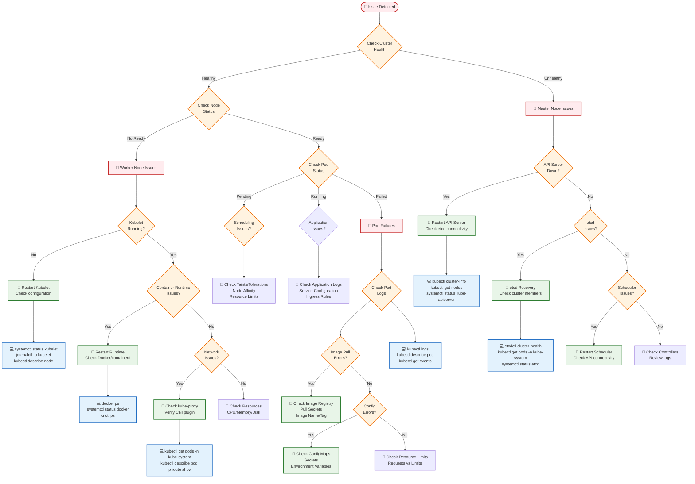

```mermaid
flowchart TD
    Start([🚨 Issue Detected]) --> CheckCluster{Check Cluster<br/>Health}
    
    CheckCluster -->|Healthy| CheckNodes{Check Node<br/>Status}
    CheckCluster -->|Unhealthy| MasterIssue[🔴 Master Node Issues]
    
    MasterIssue --> APIDown{API Server<br/>Down?}
    APIDown -->|Yes| FixAPI[🔧 Restart API Server<br/>Check etcd connectivity]
    APIDown -->|No| CheckEtcd{etcd<br/>Issues?}
    
    CheckEtcd -->|Yes| FixEtcd[🔧 etcd Recovery<br/>Check cluster members]
    CheckEtcd -->|No| CheckScheduler{Scheduler<br/>Issues?}
    
    CheckScheduler -->|Yes| FixScheduler[🔧 Restart Scheduler<br/>Check API connectivity]
    CheckScheduler -->|No| CheckControllers[🔧 Check Controllers<br/>Review logs]
    
    CheckNodes -->|NotReady| NodeIssue[🔴 Worker Node Issues]
    CheckNodes -->|Ready| CheckPods{Check Pod<br/>Status}
    
    NodeIssue --> KubeletDown{Kubelet<br/>Running?}
    KubeletDown -->|No| FixKubelet[🔧 Restart Kubelet<br/>Check configuration]
    KubeletDown -->|Yes| CheckRuntime{Container Runtime<br/>Issues?}
    
    CheckRuntime -->|Yes| FixRuntime[🔧 Restart Runtime<br/>Check Docker/containerd]
    CheckRuntime -->|No| CheckNetwork{Network<br/>Issues?}
    
    CheckNetwork -->|Yes| FixNetwork[🔧 Check kube-proxy<br/>Verify CNI plugin]
    CheckNetwork -->|No| CheckResources[🔧 Check Resources<br/>CPU/Memory/Disk]
    
    CheckPods -->|Pending| PodScheduling{Scheduling<br/>Issues?}
    CheckPods -->|Running| CheckApp{Application<br/>Issues?}
    CheckPods -->|Failed| PodFailure[🔴 Pod Failures]
    
    PodScheduling --> CheckTaints[🔧 Check Taints/Tolerations<br/>Node Affinity<br/>Resource Limits]
    
    PodFailure --> CheckLogs{Check Pod<br/>Logs}
    CheckLogs --> ImageIssue{Image Pull<br/>Errors?}
    ImageIssue -->|Yes| FixImage[🔧 Check Image Registry<br/>Pull Secrets<br/>Image Name/Tag]
    ImageIssue -->|No| ConfigIssue{Config<br/>Errors?}
    
    ConfigIssue -->|Yes| FixConfig[🔧 Check ConfigMaps<br/>Secrets<br/>Environment Variables]
    ConfigIssue -->|No| ResourceLimit[🔧 Check Resource Limits<br/>Requests vs Limits]
    
    CheckApp --> AppLogs[🔧 Check Application Logs<br/>Service Configuration<br/>Ingress Rules]
    
    %% Common Commands
    FixAPI --> Commands1[💻 kubectl cluster-info<br/>kubectl get nodes<br/>systemctl status kube-apiserver]
    FixEtcd --> Commands2[💻 etcdctl cluster-health<br/>kubectl get pods -n kube-system<br/>systemctl status etcd]
    FixKubelet --> Commands3[💻 systemctl status kubelet<br/>journalctl -u kubelet<br/>kubectl describe node]
    FixRuntime --> Commands4[💻 docker ps<br/>systemctl status docker<br/>crictl ps]
    FixNetwork --> Commands5[💻 kubectl get pods -n kube-system<br/>kubectl describe pod <kube-proxy><br/>ip route show]
    CheckLogs --> Commands6[💻 kubectl logs <pod><br/>kubectl describe pod <pod><br/>kubectl get events]
    
    %% Styling
    classDef issue fill:#ffebee,stroke:#c62828,stroke-width:2px
    classDef fix fill:#e8f5e8,stroke:#2e7d32,stroke-width:2px
    classDef check fill:#fff3e0,stroke:#ef6c00,stroke-width:2px
    classDef command fill:#e3f2fd,stroke:#1565c0,stroke-width:2px
    
    class Start,MasterIssue,NodeIssue,PodFailure issue
    class FixAPI,FixEtcd,FixScheduler,FixKubelet,FixRuntime,FixNetwork,FixImage,FixConfig fix
    class CheckCluster,CheckNodes,CheckPods,APIDown,CheckEtcd,CheckScheduler,KubeletDown,CheckRuntime,CheckNetwork,PodScheduling,CheckLogs,ImageIssue,ConfigIssue check
    class Commands1,Commands2,Commands3,Commands4,Commands5,Commands6 command
```
