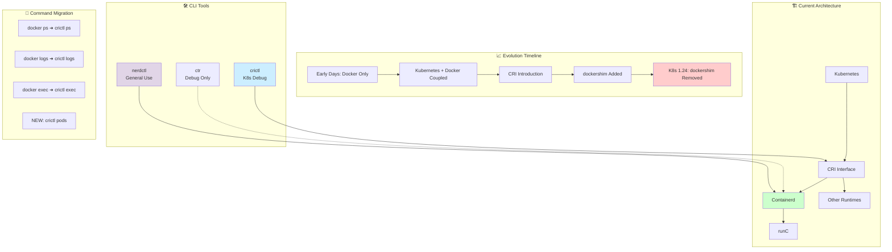

```mermaid
flowchart TD
    subgraph Evolution["📈 Evolution Timeline"]
        A["Early Days: Docker Only"] --> B["Kubernetes + Docker Coupled"]
        B --> C["CRI Introduction"]
        C --> D["dockershim Added"]
        D --> E["K8s 1.24: dockershim Removed"]
    end

    subgraph Current["🏗️ Current Architecture"]
        F["Kubernetes"] --> G["CRI Interface"]
        G --> H["Containerd"]
        G --> I["Other Runtimes"]
        H --> J["runC"]
    end

    subgraph Tools["🛠️ CLI Tools"]
        K["ctr<br/>Debug Only"] -.-> H
        L["nerdctl<br/>General Use"] --> H
        M["crictl<br/>K8s Debug"] --> G
    end

    subgraph Migration["🔄 Command Migration"]
        N["docker ps ➜ crictl ps"]
        O["docker logs ➜ crictl logs"]
        P["docker exec ➜ crictl exec"]
        Q["NEW: crictl pods"]
    end

    style E fill:#ffcccc
    style H fill:#ccffcc
    style M fill:#cceeff
    style L fill:#e1d5e7
```
