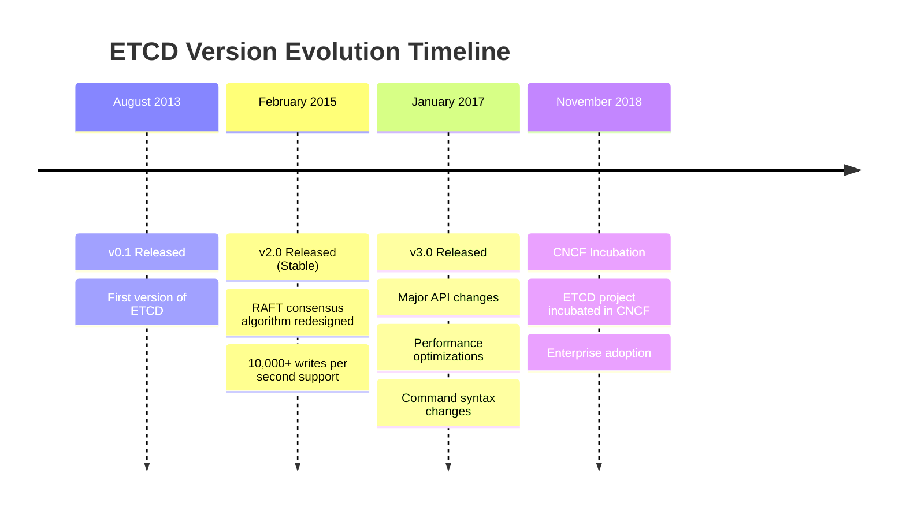

```mermaid
timeline
    title ETCD Version Evolution Timeline
    
    August 2013 : v0.1 Released
                : First version of ETCD
    
    February 2015 : v2.0 Released (Stable)
                  : RAFT consensus algorithm redesigned
                  : 10,000+ writes per second support
    
    January 2017 : v3.0 Released
                 : Major API changes
                 : Performance optimizations
                 : Command syntax changes
    
    November 2018 : CNCF Incubation
                  : ETCD project incubated in CNCF
                  : Enterprise adoption

```
