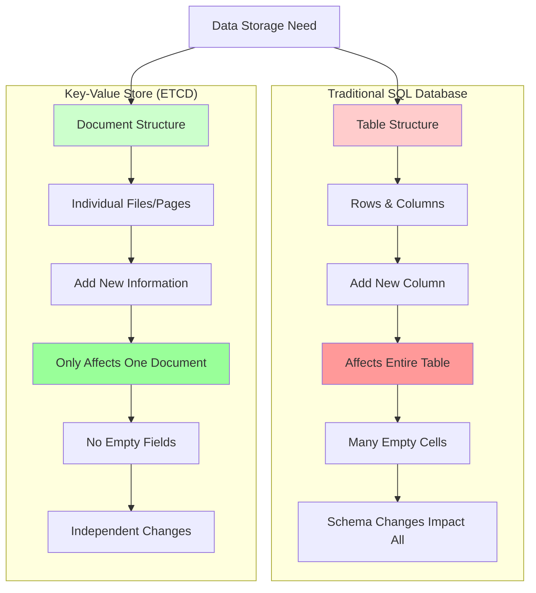

```mermaid
graph TD
    subgraph "Traditional SQL Database"
        A[Table Structure] --> B[Rows & Columns]
        B --> C[Add New Column]
        C --> D[Affects Entire Table]
        D --> E[Many Empty Cells]
        E --> F[Schema Changes Impact All]
    end
    
    subgraph "Key-Value Store (ETCD)"
        G[Document Structure] --> H[Individual Files/Pages]
        H --> I[Add New Information]
        I --> J[Only Affects One Document]
        J --> K[No Empty Fields]
        K --> L[Independent Changes]
    end
    
    M[Data Storage Need] --> A
    M --> G
    
    style A fill:#ffcccc
    style G fill:#ccffcc
    style D fill:#ff9999
    style J fill:#99ff99
```
