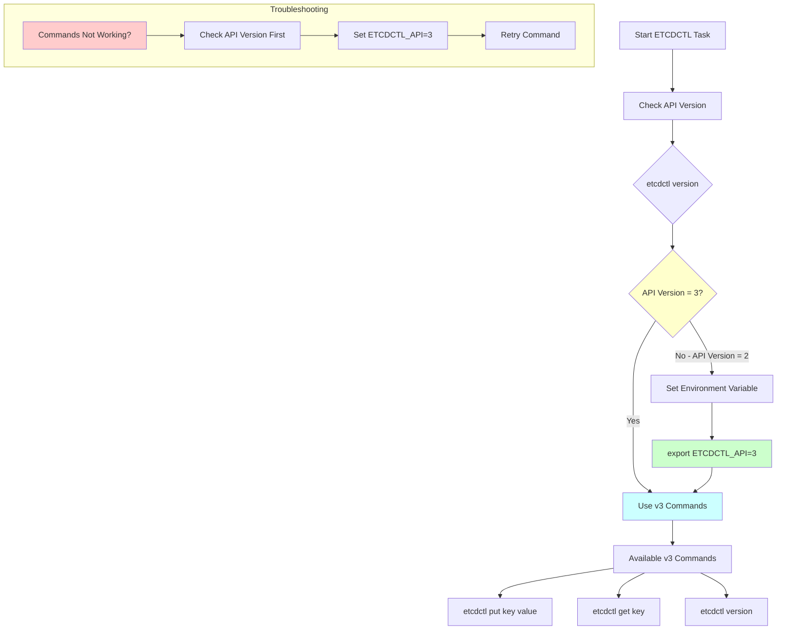

```mermaid
flowchart TD
    A[Start ETCDCTL Task] --> B[Check API Version]
    B --> C{etcdctl version}
    C --> D{API Version = 3?}
    
    D -->|Yes| E[Use v3 Commands]
    D -->|No - API Version = 2| F[Set Environment Variable]
    
    F --> G[export ETCDCTL_API=3]
    G --> E
    
    E --> H[Available v3 Commands]
    H --> I[etcdctl put key value]
    H --> J[etcdctl get key]
    H --> K[etcdctl version]
    
    subgraph "Troubleshooting"
        L[Commands Not Working?] --> M[Check API Version First]
        M --> N[Set ETCDCTL_API=3]
        N --> O[Retry Command]
    end
    
    style D fill:#ffffcc
    style G fill:#ccffcc
    style E fill:#ccffff
    style L fill:#ffcccc
```
