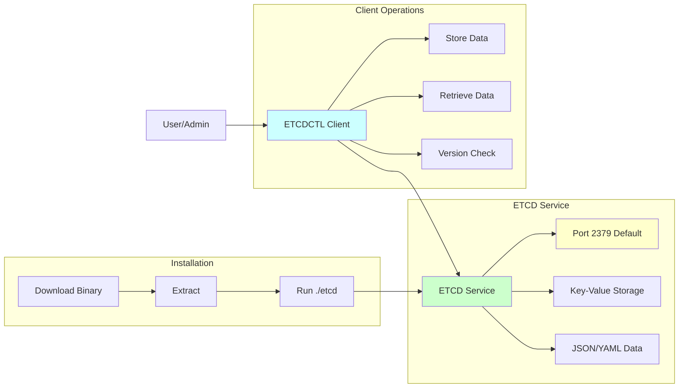

```mermaid
graph LR
    A[User/Admin] --> B[ETCDCTL Client]
    B --> C[ETCD Service]
    
    subgraph "ETCD Service"
        C --> D[Port 2379 Default]
        C --> E[Key-Value Storage]
        C --> F[JSON/YAML Data]
    end
    
    subgraph "Client Operations"
        B --> G[Store Data]
        B --> H[Retrieve Data]
        B --> I[Version Check]
    end
    
    subgraph "Installation"
        J[Download Binary] --> K[Extract]
        K --> L[Run ./etcd]
        L --> C
    end
    
    style C fill:#ccffcc
    style D fill:#ffffcc
    style B fill:#ccffff
```
