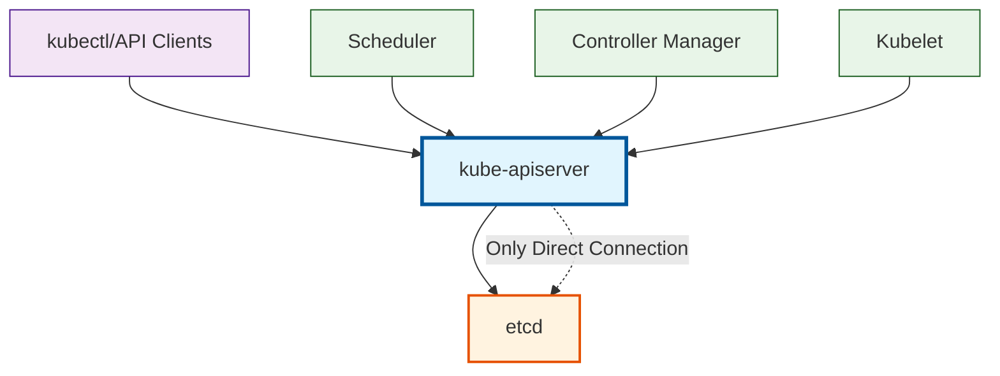
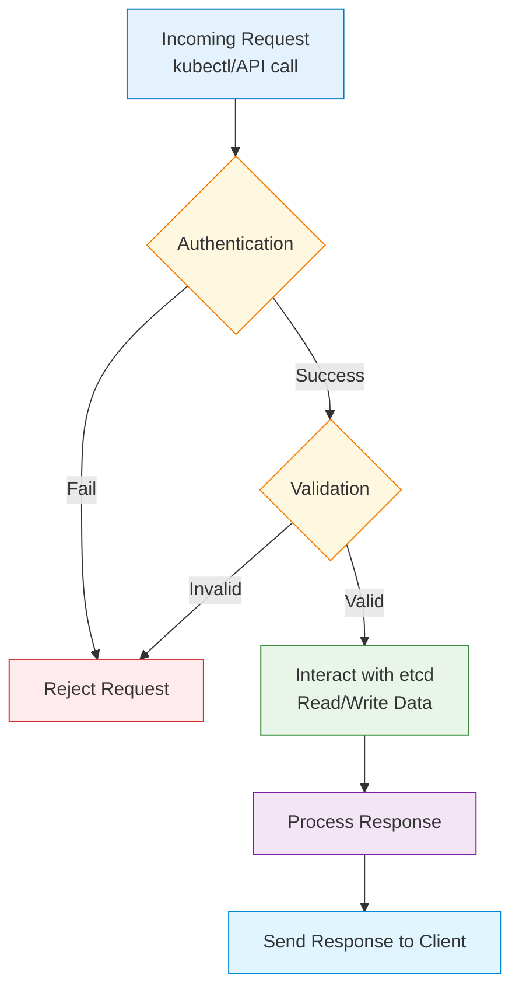

```mermaid
graph TD
    A[kubectl/API Clients] --> B[kube-apiserver]
    B --> C[etcd]
    
    D[Scheduler] --> B
    E[Controller Manager] --> B
    F[Kubelet] --> B
    
    B -.->|"Only Direct Connection"| C
    
    style B fill:#e1f5fe,stroke:#01579b,stroke-width:3px
    style C fill:#fff3e0,stroke:#e65100,stroke-width:2px
    style A fill:#f3e5f5,stroke:#4a148c
    style D fill:#e8f5e8,stroke:#1b5e20
    style E fill:#e8f5e8,stroke:#1b5e20
    style F fill:#e8f5e8,stroke:#1b5e20
```

---

```mermaid

flowchart TD
    A[Incoming Request<br/>kubectl/API call] --> B{Authentication}
    B -->|Success| C{Validation}
    B -->|Fail| G[Reject Request]
    C -->|Valid| D[Interact with etcd<br/>Read/Write Data]
    C -->|Invalid| G
    D --> E[Process Response]
    E --> F[Send Response to Client]
    
    style A fill:#e3f2fd,stroke:#0277bd
    style B fill:#fff8e1,stroke:#f57c00
    style C fill:#fff8e1,stroke:#f57c00
    style D fill:#e8f5e8,stroke:#388e3c
    style E fill:#f3e5f5,stroke:#7b1fa2
    style F fill:#e1f5fe,stroke:#0288d1
    style G fill:#ffebee,stroke:#d32f2f
```

---

