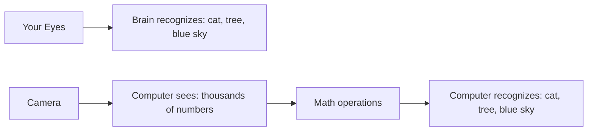
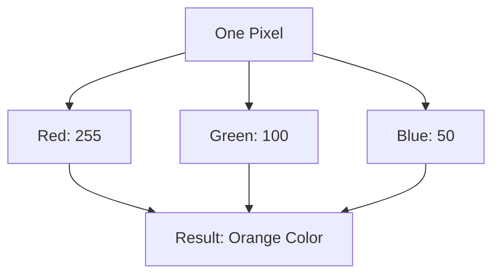
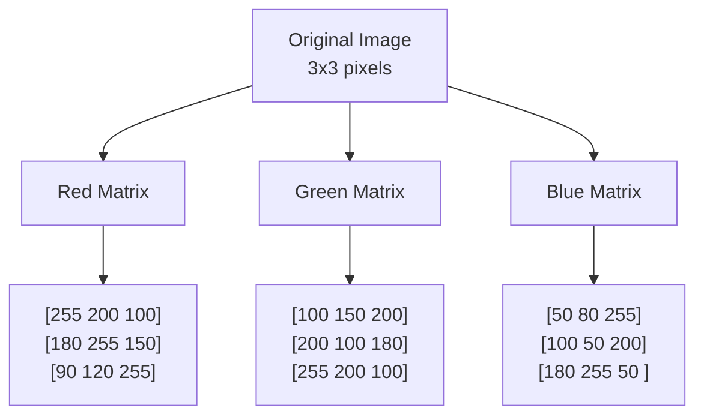
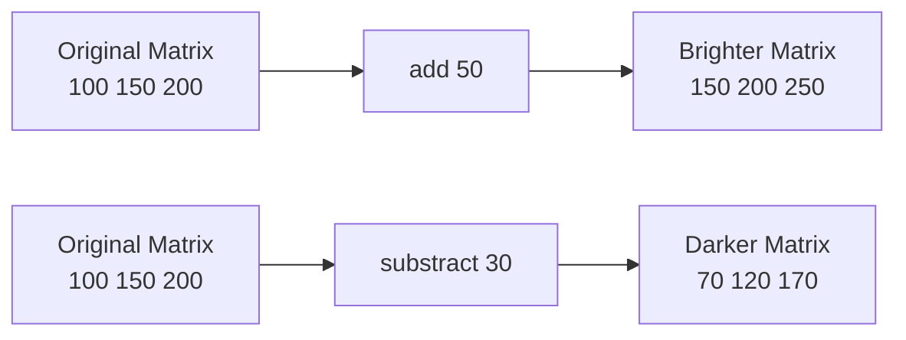
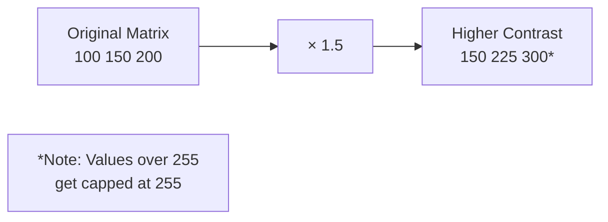
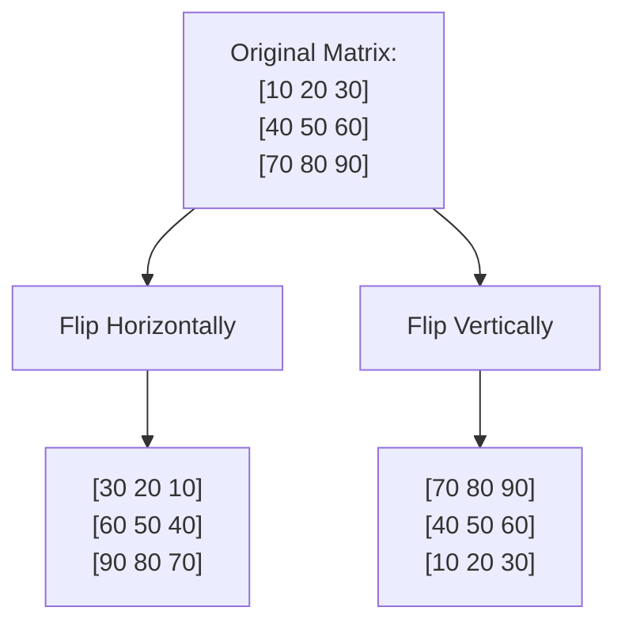
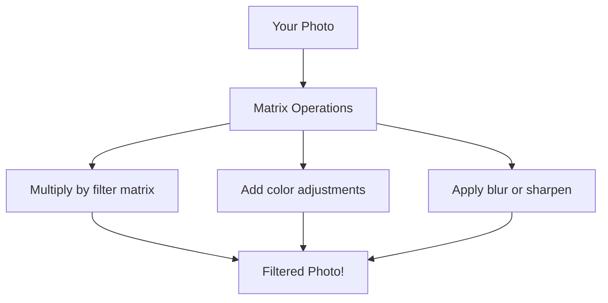
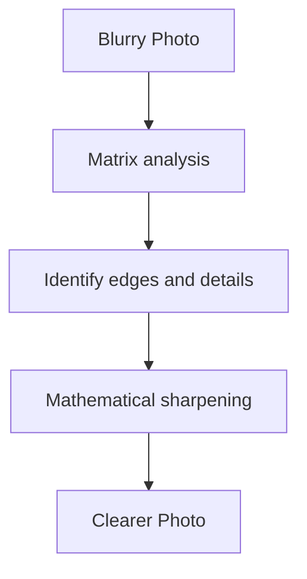
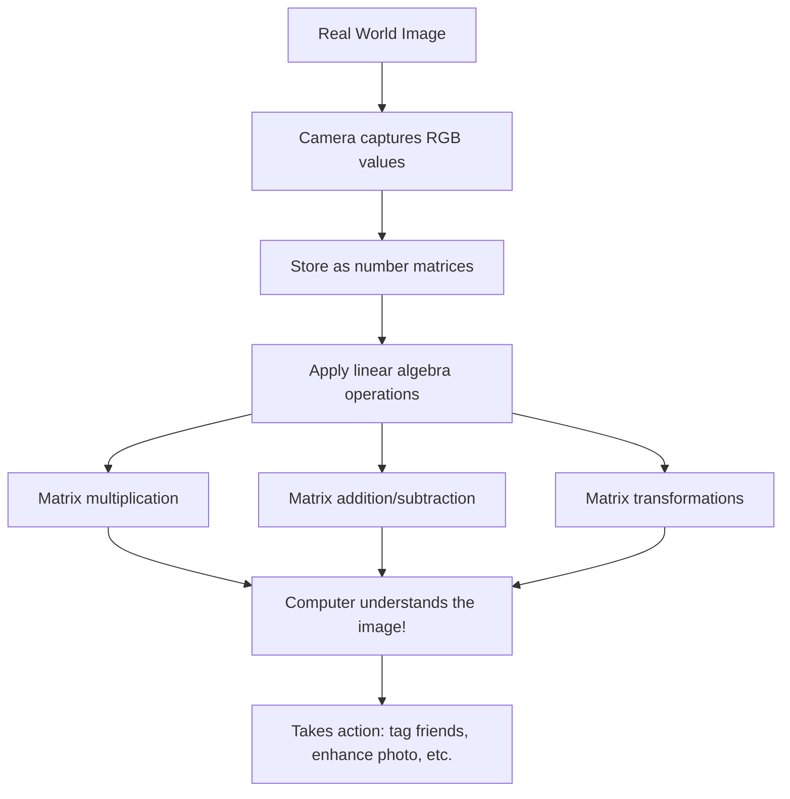

# Linear Algebra in Computer Vision: How Computers See Images

## How Your Eyes vs. Computer "Eyes" Work

When you look at a photo, you instantly see objects, colors, and scenes. But computers don't have eyes like yours - they need to turn everything into numbers to understand it!



## What is an RGB Image?

Every digital image is made of tiny colored dots called **pixels**. Each pixel has three numbers that tell us how much Red, Green, and Blue light it contains.



**Think of it like mixing paint:**
- Red = 255 (maximum), Green = 100 (a little), Blue = 50 (very little) = Orange color
- Numbers go from 0 (none of that color) to 255 (maximum of that color)

## Images Become Matrices (Number Grids)

A matrix is just a rectangular grid of numbers. When a computer looks at an image, it converts it into three matrices - one for each color!



## Cool Things We Can Do With Matrix Math

### 1. Making Images Brighter or Darker



**The math:** Add the same number to every pixel = brighter image!

### 2. Changing Contrast (Making Differences More Dramatic)



### 3. Flipping Images



## Real-World Applications You Use Every Day

### Instagram Filters


### Face Detection


### Photo Enhancement


## Simple Example: Making a Smiley Face Brighter

Let's say we have a tiny 3×3 smiley face image:

**Original Red values:**
```
[100  100  100]
[150   50  150]  ← Eyes are darker (50), face is medium (100-150)
[100  200  100]  ← Smile is brighter (200)
```

**After adding +50 to make it brighter:**
```
[150  150  150]
[200  100  200]  ← Everything got 50 points brighter!
[150  250  150]
```

## Why This Matters

Linear algebra helps computers:
- **Recognize objects** (Is that a cat or a dog?)
- **Enhance photos** (Make them clearer, remove noise)
- **Create special effects** (Movie CGI, game graphics)
- **Medical imaging** (Help doctors see inside your body)
- **Self-driving cars** (Recognize stop signs and pedestrians)

## The Big Picture



**The amazing part:** All the complex image processing you see in apps, games, and movies comes down to mathematical operations on grids of numbers. Linear algebra is the language that lets computers "see" and understand our visual world!

Every time you use a camera app, play a video game, or watch a movie with special effects, linear algebra is working behind the scenes to make it all possible.