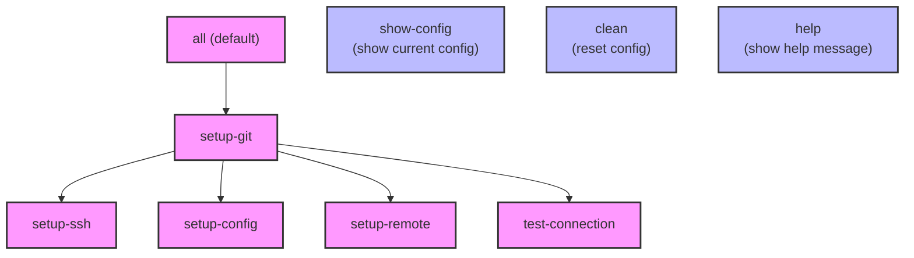

This diagram visualizes the relationships and dependencies between different targets in the Makefile.

  

  

## Diagram Explanation  

### Main Flow

- The default target `all` triggers `setup-git`

- `setup-git` depends on four main components:

- `setup-ssh`: Sets up SSH agent and adds key

- `setup-config`: Configures Git user settings

- `setup-remote`: Sets up remote URL

- `test-connection`: Tests SSH connection

### Utility Targets

Shown in blue in the diagram:

- `show-config`: Displays current Git configuration

- `clean`: Resets configuration to defaults

- `help`: Shows help message with available targets