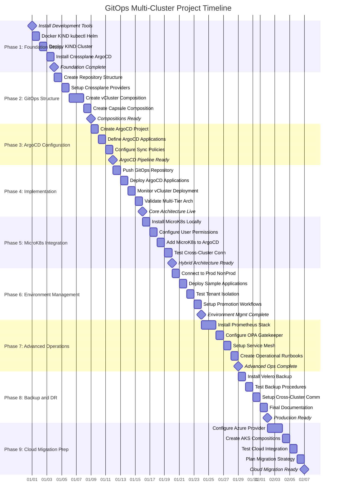
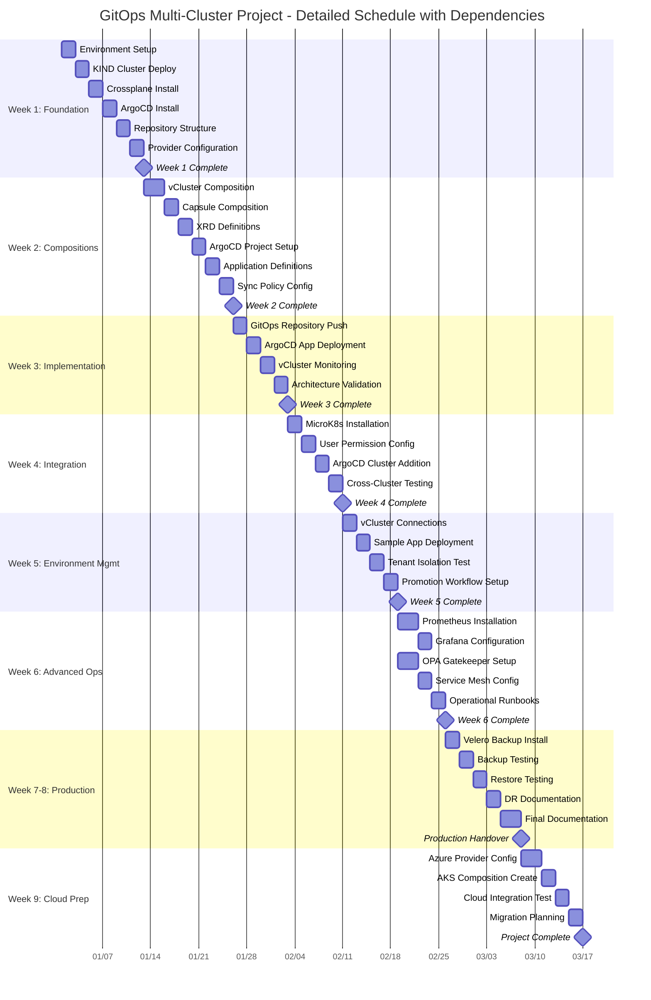

```mermaid
gantt
    title GitOps Multi-Cluster Project Timeline
    dateFormat YYYY-MM-DD
    axisFormat %m/%d

    section Phase 1: Foundation Setup
    Install Development Tools     :milestone, m1, 2024-01-01, 0d
    Docker KIND kubectl Helm      :task1, 2024-01-01, 1d
    Deploy KIND Cluster          :task2, after task1, 1d
    Install Crossplane ArgoCD    :task3, after task2, 1d
    Foundation Complete          :milestone, m2, after task3, 0d

    section Phase 2: GitOps Structure  
    Create Repository Structure  :task4, after m2, 1d
    Setup Crossplane Providers  :task5, after task4, 1d
    Create vCluster Composition  :task6, after task5, 2d
    Create Capsule Composition   :task7, after task6, 1d
    Compositions Ready          :milestone, m3, after task7, 0d

    section Phase 3: ArgoCD Configuration
    Create ArgoCD Project       :task8, after m3, 1d
    Define ArgoCD Applications  :task9, after task8, 1d
    Configure Sync Policies     :task10, after task9, 1d
    ArgoCD Pipeline Ready       :milestone, m4, after task10, 0d

    section Phase 4: Implementation
    Push GitOps Repository      :task11, after m4, 1d
    Deploy ArgoCD Applications  :task12, after task11, 1d
    Monitor vCluster Deployment :task13, after task12, 1d
    Validate Multi-Tier Arch    :task14, after task13, 1d
    Core Architecture Live      :milestone, m5, after task14, 0d

    section Phase 5: MicroK8s Integration
    Install MicroK8s Locally    :task15, after m5, 1d
    Configure User Permissions  :task16, after task15, 1d
    Add MicroK8s to ArgoCD      :task17, after task16, 1d
    Test Cross-Cluster Conn     :task18, after task17, 1d
    Hybrid Architecture Ready   :milestone, m6, after task18, 0d

    section Phase 6: Environment Management
    Connect to Prod NonProd     :task19, after m6, 1d
    Deploy Sample Applications  :task20, after task19, 1d
    Test Tenant Isolation      :task21, after task20, 1d
    Setup Promotion Workflows  :task22, after task21, 1d
    Environment Mgmt Complete   :milestone, m7, after task22, 0d

    section Phase 7: Advanced Operations
    Install Prometheus Stack    :task23, after m7, 2d
    Configure OPA Gatekeeper    :task24, after task23, 1d
    Setup Service Mesh          :task25, after task24, 1d
    Create Operational Runbooks :task26, after task25, 1d
    Advanced Ops Complete       :milestone, m8, after task26, 0d

    section Phase 8: Backup and DR
    Install Velero Backup       :task27, after m8, 1d
    Test Backup Procedures      :task28, after task27, 1d
    Setup Cross-Cluster Comm    :task29, after task28, 1d
    Final Documentation         :task30, after task29, 1d
    Production Ready            :milestone, m9, after task30, 0d

    section Phase 9: Cloud Migration Prep
    Configure Azure Provider    :task31, after m9, 2d
    Create AKS Compositions     :task32, after task31, 1d
    Test Cloud Integration      :task33, after task32, 1d
    Plan Migration Strategy     :task34, after task33, 1d
    Cloud Migration Ready       :milestone, m10, after task34, 0d
```
---

```mermaid
gantt
    title GitOps Multi-Cluster Project - Detailed Schedule with Dependencies
    dateFormat YYYY-MM-DD
    axisFormat %m/%d

    section Week 1: Foundation
    
    Environment Setup           :env1, 2024-01-01, 2d
    
    KIND Cluster Deploy         :kind1, after env1, 2d
    
    Crossplane Install          :cp1, after kind1, 2d
    
    ArgoCD Install              :argo1, after cp1, 2d
    
    Repository Structure        :repo1, after argo1, 2d
    
    Provider Configuration      :prov1, after repo1, 2d
    
    Week 1 Complete             :milestone, w1, after prov1, 0d

    section Week 2: Compositions
    
    vCluster Composition        :vcomp1, after w1, 3d
    
    Capsule Composition         :ccomp1, after vcomp1, 2d
    
    XRD Definitions            :xrd1, after ccomp1, 2d
    
    ArgoCD Project Setup       :aproj1, after xrd1, 2d
    
    Application Definitions    :adef1, after aproj1, 2d
    
    Sync Policy Config         :sync1, after adef1, 2d
    
    Week 2 Complete            :milestone, w2, after sync1, 0d

    section Week 3: Implementation
    
    GitOps Repository Push     :push1, after w2, 2d
    
    ArgoCD App Deployment      :adeploy1, after push1, 2d
    
    vCluster Monitoring        :vmon1, after adeploy1, 2d
    
    Architecture Validation    :valid1, after vmon1, 2d
    
    Week 3 Complete           :milestone, w3, after valid1, 0d

    section Week 4: Integration
    
    MicroK8s Installation     :mk8s1, after w3, 2d
    
    User Permission Config     :perm1, after mk8s1, 2d
    
    ArgoCD Cluster Addition    :cluster1, after perm1, 2d
    
    Cross-Cluster Testing      :xtest1, after cluster1, 2d
    
    Week 4 Complete           :milestone, w4, after xtest1, 0d

    section Week 5: Environment Mgmt
    
    vCluster Connections      :vconn1, after w4, 2d
    
    Sample App Deployment     :sapp1, after vconn1, 2d
    
    Tenant Isolation Test     :ttest1, after sapp1, 2d
    
    Promotion Workflow Setup  :pflow1, after ttest1, 2d
    
    Week 5 Complete          :milestone, w5, after pflow1, 0d

    section Week 6: Advanced Ops
    
    Prometheus Installation   :prom1, after w5, 3d
    
    Grafana Configuration     :graf1, after prom1, 2d
    
    OPA Gatekeeper Setup      :opa1, after w5, 3d
    
    Service Mesh Config       :mesh1, after opa1, 2d
    
    Operational Runbooks      :runb1, after graf1, 2d
    
    Week 6 Complete          :milestone, w6, after runb1, 0d

    section Week 7-8: Production
    
    Velero Backup Install     :vel1, after w6, 2d
    
    Backup Testing           :btest1, after vel1, 2d
    
    Restore Testing          :rtest1, after btest1, 2d
    
    DR Documentation         :drdoc1, after rtest1, 2d
    
    Final Documentation      :fdoc1, after drdoc1, 3d
    
    Production Handover      :milestone, prod, after fdoc1, 0d

    section Week 9: Cloud Prep
    
    Azure Provider Config    :azure1, after prod, 3d
    
    AKS Composition Create   :aks1, after azure1, 2d
    
    Cloud Integration Test   :ctest1, after aks1, 2d
    
    Migration Planning       :mplan1, after ctest1, 2d
    
    Project Complete         :milestone, complete, after mplan1, 0d
```