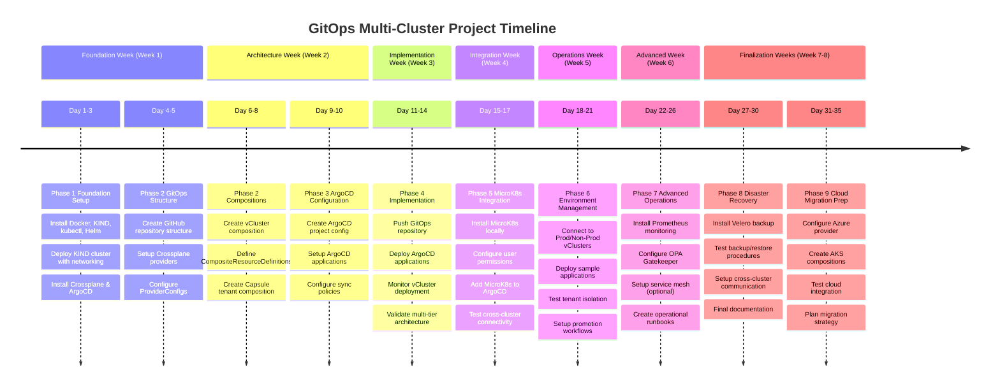
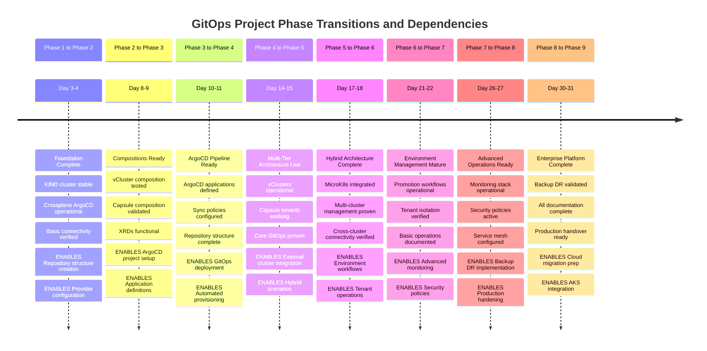

```mermaid
timeline
    title GitOps Multi-Cluster Project Timeline

    section Foundation Week (Week 1)
        Day 1-3 : Phase 1 Foundation Setup
                : Install Docker, KIND, kubectl, Helm
                : Deploy KIND cluster with networking
                : Install Crossplane & ArgoCD
        Day 4-5 : Phase 2 GitOps Structure
                : Create GitHub repository structure
                : Setup Crossplane providers
                : Configure ProviderConfigs

    section Architecture Week (Week 2)
        Day 6-8 : Phase 2 Compositions
                : Create vCluster composition
                : Define CompositeResourceDefinitions
                : Create Capsule tenant composition
        Day 9-10 : Phase 3 ArgoCD Configuration
                 : Create ArgoCD project config
                 : Setup ArgoCD applications
                 : Configure sync policies

    section Implementation Week (Week 3)
        Day 11-14 : Phase 4 Implementation
                  : Push GitOps repository
                  : Deploy ArgoCD applications
                  : Monitor vCluster deployment
                  : Validate multi-tier architecture

    section Integration Week (Week 4)
        Day 15-17 : Phase 5 MicroK8s Integration
                  : Install MicroK8s locally
                  : Configure user permissions
                  : Add MicroK8s to ArgoCD
                  : Test cross-cluster connectivity

    section Operations Week (Week 5)
        Day 18-21 : Phase 6 Environment Management
                  : Connect to Prod/Non-Prod vClusters
                  : Deploy sample applications
                  : Test tenant isolation
                  : Setup promotion workflows

    section Advanced Week (Week 6)
        Day 22-26 : Phase 7 Advanced Operations
                  : Install Prometheus monitoring
                  : Configure OPA Gatekeeper
                  : Setup service mesh (optional)
                  : Create operational runbooks

    section Finalization Weeks (Week 7-8)
        Day 27-30 : Phase 8 Disaster Recovery
                  : Install Velero backup
                  : Test backup/restore procedures
                  : Setup cross-cluster communication
                  : Final documentation
        Day 31-35 : Phase 9 Cloud Migration Prep
                  : Configure Azure provider
                  : Create AKS compositions
                  : Test cloud integration
                  : Plan migration strategy

```

```mermaid
timeline
    title GitOps Multi-Cluster Project - Critical Milestones

    section Week 1
        Day 1    : Environment Ready
                 : Docker KIND kubectl installed
                 : Development environment validated
        Day 2    : Control Plane Active
                 : KIND cluster operational
                 : Port mappings configured
        Day 3    : Platform Services Running
                 : Crossplane installed CRDs created
                 : ArgoCD accessible via UI
        Day 5    : GitOps Foundation Ready
                 : Repository structure created
                 : Crossplane providers configured

    section Week 2
        Day 8    : Multi-Tier Compositions Complete
                 : vCluster composition working
                 : Capsule tenant composition ready
                 : XRDs defined and validated
        Day 10   : ArgoCD Pipeline Configured
                 : ArgoCD project created
                 : Applications defined
                 : Sync policies configured

    section Week 3
        Day 11   : GitOps Pipeline Active
                 : Repository connected to ArgoCD
                 : Initial sync successful
        Day 12   : vClusters Deploying
                 : Crossplane providers operational
                 : vCluster resources creating
        Day 14   : Multi-Tier Architecture Live
                 : Prod Non-Prod vClusters running
                 : Capsule tenants operational
                 : Tenant isolation verified

    section Week 4
        Day 15   : MicroK8s Operational
                 : Local MicroK8s cluster ready
                 : Required addons enabled
        Day 17   : Hybrid Architecture Active
                 : MicroK8s registered with ArgoCD
                 : Cross-cluster connectivity tested
                 : Multi-cluster management proven

    section Week 5
        Day 19   : Sample Workloads Deployed
                 : Applications running in dev tenant
                 : Applications running in staging tenant
        Day 21   : Environment Management Ready
                 : Promotion workflows tested
                 : Resource quotas validated
                 : Operational procedures documented

    section Week 6
        Day 24   : Observability Stack Active
                 : Prometheus monitoring operational
                 : Grafana dashboards configured
                 : Alerting rules tested
        Day 26   : Security Governance Ready
                 : OPA Gatekeeper policies active
                 : Service mesh configured optional
                 : Compliance scanning operational

    section Week 7-8
        Day 28   : Backup DR Validated
                 : Velero backup operational
                 : Restore procedures tested
                 : DR runbooks documented
        Day 30   : Project Complete
                 : All documentation finalized
                 : Knowledge transfer completed
                 : Production handover ready
        Day 35   : Cloud Migration Ready Optional
                 : Azure provider configured
                 : AKS compositions tested
                 : Migration strategy documented
```

```mermaid
timeline
    title GitOps Project Phase Transitions and Dependencies

    section Phase 1 to Phase 2
        Day 3-4  : Foundation Complete
                 : KIND cluster stable
                 : Crossplane ArgoCD operational
                 : Basic connectivity verified
                 : ENABLES Repository structure creation
                 : ENABLES Provider configuration

    section Phase 2 to Phase 3
        Day 8-9  : Compositions Ready
                 : vCluster composition tested
                 : Capsule composition validated
                 : XRDs functional
                 : ENABLES ArgoCD project setup
                 : ENABLES Application definitions

    section Phase 3 to Phase 4
        Day 10-11 : ArgoCD Pipeline Ready
                  : ArgoCD applications defined
                  : Sync policies configured
                  : Repository structure complete
                  : ENABLES GitOps deployment
                  : ENABLES Automated provisioning

    section Phase 4 to Phase 5
        Day 14-15 : Multi-Tier Architecture Live
                  : vClusters operational
                  : Capsule tenants working
                  : Core GitOps proven
                  : ENABLES External cluster integration
                  : ENABLES Hybrid scenarios

    section Phase 5 to Phase 6
        Day 17-18 : Hybrid Architecture Complete
                  : MicroK8s integrated
                  : Multi-cluster management proven
                  : Cross-cluster connectivity verified
                  : ENABLES Environment workflows
                  : ENABLES Tenant operations

    section Phase 6 to Phase 7
        Day 21-22 : Environment Management Mature
                  : Promotion workflows operational
                  : Tenant isolation verified
                  : Basic operations documented
                  : ENABLES Advanced monitoring
                  : ENABLES Security policies

    section Phase 7 to Phase 8
        Day 26-27 : Advanced Operations Ready
                  : Monitoring stack operational
                  : Security policies active
                  : Service mesh configured
                  : ENABLES Backup DR implementation
                  : ENABLES Production hardening

    section Phase 8 to Phase 9
        Day 30-31 : Enterprise Platform Complete
                  : Backup DR validated
                  : All documentation complete
                  : Production handover ready
                  : ENABLES Cloud migration prep
                  : ENABLES AKS integration
```