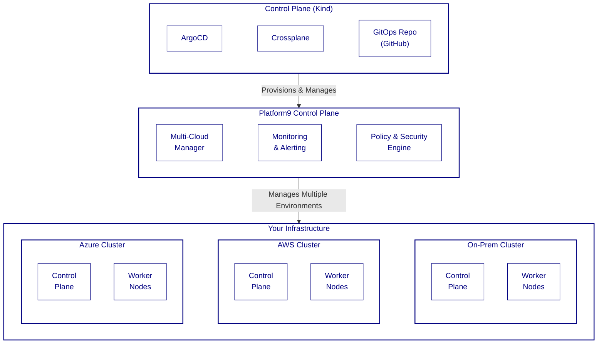
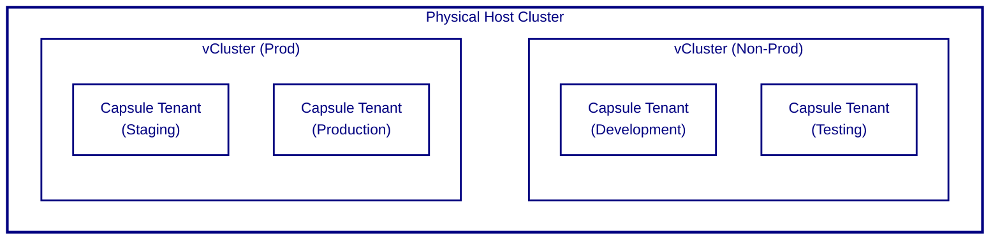

```mermaid

graph TB

subgraph KIND ["Control Plane (Kind)"]

ARGOCD["ArgoCD"]

CROSSPLANE["Crossplane"]

GITOPS["GitOps Repo<br/>(GitHub)"]

end

KIND -->|Provisions & Manages| SaaS

subgraph SaaS ["Platform9 Control Plane"]

MCM["Multi-Cloud<br/>Manager"]

MON["Monitoring<br/>& Alerting"]

PSE["Policy & Security<br/>Engine"]

end

SaaS -->|Manages Multiple Environments| INFRA

subgraph INFRA ["Your Infrastructure"]

subgraph AZURE ["Azure Cluster"]

direction TB

ACP["Control<br/>Plane"]

AWN["Worker<br/>Nodes"]

end

subgraph AWS ["AWS Cluster"]

direction TB

AWSCP["Control<br/>Plane"]

AWSWN["Worker<br/>Nodes"]

end

subgraph ONPREM ["On-Prem Cluster"]

direction TB

OCP["Control<br/>Plane"]

OWN["Worker<br/>Nodes"]

end

end

%% Force horizontal layout within subgraphs

ARGOCD ~~~ CROSSPLANE ~~~ GITOPS

MCM ~~~ MON ~~~ PSE

AZURE ~~~ AWS ~~~ ONPREM

%% Styling

classDef kindBox fill:#ffffff,stroke:#000080,stroke-width:2px,color:#000080

classDef saasBox fill:#ffffff,stroke:#000080,stroke-width:2px,color:#000080

classDef infraBox fill:#ffffff,stroke:#000080,stroke-width:2px,color:#000080

classDef clusterBox fill:#ffffff,stroke:#000080,stroke-width:2px,color:#000080

classDef componentBox fill:#ffffff,stroke:#000080,stroke-width:1px,color:#000080

class KIND kindBox

class SaaS saasBox

class INFRA infraBox

class AZURE,AWS,ONPREM clusterBox

class ARGOCD,CROSSPLANE,GITOPS,MCM,MON,PSE,ACP,AWN,AWSCP,AWSWN,OCP,OWN componentBox

```

  

```mermaid

graph TB

subgraph PHYSICAL ["Physical Host Cluster"]

subgraph PROD ["vCluster (Prod)"]

STAGING["Capsule Tenant<br/>(Staging)"]

PRODUCTION["Capsule Tenant<br/>(Production)"]

end

subgraph NONPROD ["vCluster (Non-Prod)"]

DEVELOPMENT["Capsule Tenant<br/>(Development)"]

TESTING["Capsule Tenant<br/>(Testing)"]

end

end

%% Force horizontal layout for vClusters

PROD ~~~ NONPROD

%% Styling

classDef physicalBox fill:#ffffff,stroke:#000080,stroke-width:3px,color:#000080

classDef vclusterBox fill:#ffffff,stroke:#000080,stroke-width:2px,color:#000080

classDef capsuleBox fill:#ffffff,stroke:#000080,stroke-width:2px,color:#000080

class PHYSICAL physicalBox

class PROD,NONPROD vclusterBox

class STAGING,PRODUCTION,DEVELOPMENT,TESTING capsuleBox

```